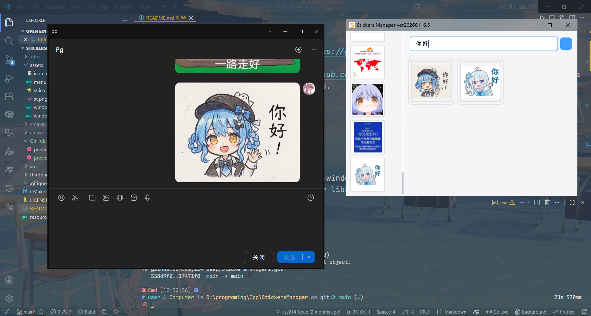

<h1 align="center">
StickersManager
</h1>

    
    
    
    
    

# Introduction

Rewrite using C++/Qt
[csy214-beep/StickersManager](https://github.com/csy214-beep/StickersManager)

Refer to [EweSticker](https://github.com/FredHappyface/Android.EweSticker) to implement a sticker management tool on Windows.

# Preview

# Features

- Shortcut keys to open/close the window
- Use local folders as the sticker library, with subdirectories as categories
- Support file name search
- Written in C++/Qt, high performance
- Double-click to copy, streamlining tedious operations

# Third-Party Libraries

[Qt6.10.1](https://www.qt.io/)

[nothings/stb](https://github.com/nothings/stb)

# Related Resources

Sticker pack library that seamlessly integrates with the software in this repository: [csy214-beep/EMO](https://github.com/csy214-beep/EMO)

# License

[CC BY-NC 4.0](https://creativecommons.org/licenses/by-nc/4.0/)
