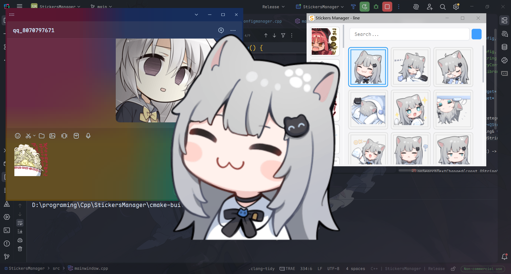

<h1 align="center">
StickersManager
</h1>
<p align="center">
    
    
    
    
    
</p>

## Overview

StickersManager is a Windows Sticker Management Tool built with C++20 and Qt 6.10.1. It provides a user-friendly
interface for managing and using sticker packs from local folders.



## Features

- **Multi-Window Support**: One window per enabled sticker library
- **Global Hotkeys**: Customizable shortcuts to open/close windows
- **Local Library**: Use local folders as sticker libraries, with subdirectories as categories
- **Search Functionality**: Support for file name search
- **High Performance**: Written in C++/Qt for optimal performance
- **Easy Copy**: Double-click to copy stickers to clipboard
- **Image Preview**: Right-click to preview full-size images
- **Responsive Layout**: Adapts to window size while respecting configuration
- **First-Time Setup**: Guided library selection for new users

## Project Structure

```txt
StickersManager/
├── .gitignore
├── CMakeLists.txt
├── LICENSE
├── README.md
├── resources.qrc
├── assets/
│   ├── icon.rc
│   ├── menu.qss
│   ├── st.ico
│   ├── st.png
│   ├── window.qss
│   └── window2.qss
├── docs/
│   └── .ai
├── src/
└── thirdparty/
    └── stb/
        ├── stb_image.h
        └── stb_image_resize2.h
```

## Documentation

For detailed documentation, please refer to the files in the `docs/.ai/` directory:

1. **architecture.md** - Project architecture and design
2. **files.md** - File structure and key files
3. **config.md** - Configuration system
4. **features.md** - Feature implementation details
5. **changelog.md** - Change history

## Third-Party Libraries

- [Qt 6.10.1](https://www.qt.io/)
- [stb_image](https://github.com/nothings/stb)

## Related Resources

Sticker pack library that seamlessly integrates with this software: [csy214-beep/EMO](https://github.com/csy214-beep/EMO)

> [!NOTE]
> We will not provide the stickers used to develop this software.
>
> Please configure with the software completely closed.

## Config

example:

```json
{
    "behavior": {
        "copyOnDoubleClick": true,
        "highlightOnClick": true,
        "searchDelayMs": 300
    },
    "libraries": [
        {
            "enabled": true,
            "hotkey": "Ctrl+Shift+E",
            "path": "D:/Users/user/Pictures/EMO/emo"
        },
        {
            "enabled": true,
            "hotkey": "Ctrl+Shift+A",
            "path": "D:/Users/user/Pictures/line"
        }
    ],
    "libraryPath": "",
    "performance": {
        "lazyLoadEnabled": true,
        "thumbnailCacheSize": 200
    },
    "port": 8868,
    "shortcuts": {
        "hotkey": "Ctrl+Shift+E",
        "useHotkey": true
    },
    "ui": {
        "categoryButtonSize": 90,
        "gridCellSize": 120,
        "gridColumns": 3
    },
    "windowPosition": [
        900,
        50
    ],
    "windowSize": [
        540,
        430
    ]
}
```

## License

[CC BY-NC 4.0](https://creativecommons.org/licenses/by-nc/4.0/)
